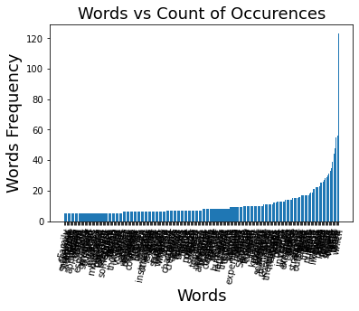
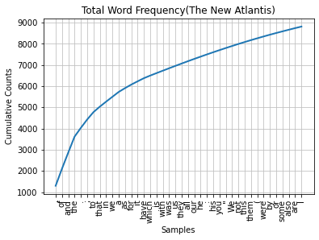
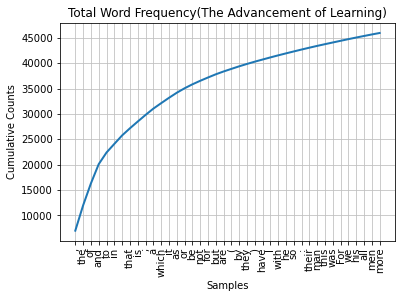
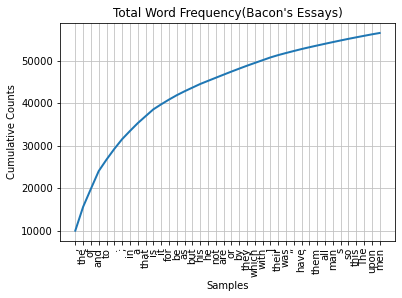
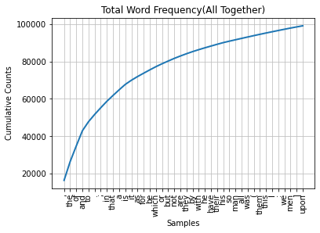
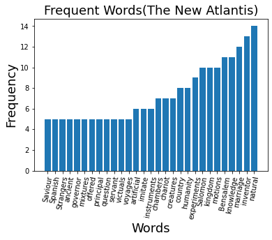
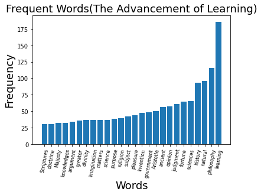
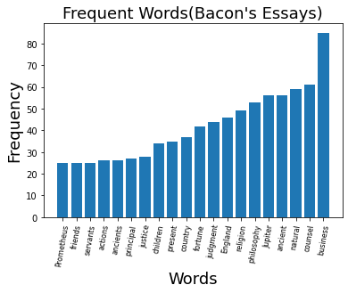
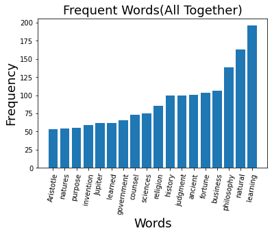

# ✍️ Inside Francis Bacon 🥓

### 🗨️... Seeing Through His Words

 ◭ 2021.12  **OSS Term Project** by Hyebin Lee ◭

 

**<작품소개>**

  **"언어는 사고의 결과이다"**, 또는 **"언어가 사고를 지배한다"** 와 같은 말이 있습니다.  실제로 한 사람이 사용하는 단어와 언어는 해당 인물이 어떤 가치관과 삶을 추구하는 지를 알 수 있는 유용한 판단 지표가 되기도 합니다. 

  이번 Term Project에서는 본인이 이번 학기 교양  `과학기술과사회` 수업에서 특히 인상깊게 읽은  `'새로운 아틀란티스(The New Atlantis)'` 의 저자이자 영국의 철학자/과학자였던 **프랜시스 베이컨 (Francis Bacon, 1561~1626)** 의 글에 사용된 단어들의 종류와 빈도수를 _Python_ 과 이의 다양한 툴킷을 통해 정량적으로 분석하고 이를 시각화하여 그가 추구했던 사상과 삶의 방향을 알아보고자 합니다.

Francis Bacon, image from wikipedia

## **Set Up & Prerequisites**

have used: 

* [Anaconda]([Anaconda | The World's Most Popular Data Science Platform](https://www.anaconda.com/))

* [NLTK (Natural Language Toolkit)]([NLTK :: Natural Language Toolkit](https://www.nltk.org/)) For extracting words and its frequency

* [Matplotlib]([Matplotlib — Visualization with Python](https://matplotlib.org/)) For Visualization

* Bacon's Books (From [Project Gutenberg]([Free eBooks | Project Gutenberg](https://www.gutenberg.org/)))
  
  * The New Atlantis
  
  * The Advancement of Learning
  
  * Bacon's Essays, and Wisdom of the Ancients

#### Installing NLTK through Anaconda

        Enter the following command in Anaconda prompt:

       `conda install -c anaconda nltk`

## Going Through the Words

I have attained three .txt files of Bacon's books through [Project Gutenberg]([Free eBooks | Project Gutenberg](https://www.gutenberg.org/)), so all the Copyright Rules are due to its terms of use.

* Tokenizing words with NLTK
  
  I got many help from [This](https://vitalflux.com/nltk-how-read-process-text-file/) website for reading text files and processing them with NLTK. But I have added my own additional conditions to produce more refined results.

* The code consists of :
  
  (It is also explained in the comment section in the code)
  
  * Reading the file (Tokenizing)
  
  * Calculating the Frequency Distribution
  
  * Plotting the words with their Frequency (Total)
  
  * Adding word length and frequency value conditions for analyzation
  
  * Eliminating useless words
  
  * Plotting the 'real' frequent words
  
  And this is about it!

* More explanation about word extract conditions and eliminating :
  
  I have set the word length conditions to having 7 or more characters since words less than 6 characters tend to have less sophisticated and less significant meanings for getting useful information about the text.
  
  For words that have no meaning but consists of 7 or more words, I have eliminated by adding `!=` conditions. It was all done by manually.
  
  | before                  | after                |
  |:-----------------------:|:--------------------:|
  |  |  |
  
  Also I have decided the `fdist[word] >= (value)` 's  `(value)` considering the length of the book; so at each cases, the value is different.

## Results and Analyzation

* #### **Total Word Frequency**

|  |    |
| -------------------- | -------------------- |
|  |  |

In the Total Word Frequency graph, all four results consisted pretty much of same words due to grammatical reasons. Most of them were less than 4 words.

* #### **The Real Frequent Words**
  
  | The New Atlantis     | The Advancement of Learning |
  | -------------------- | --------------------------- |
  |  |         |
  | **Bacon's Essays**   | **All Together**            |
  |  |         |

## Conclusion

The Frequent Words in each book were respectively:

**The New Atlantis**

[natural, inventor, marriage, knowledge, Bensalem, motions, kingdom, Salomon, experiments, humanity, country, creatures, chariot, chambers, instruments, imitate, artificial, voyages, victuals, servant, question, principal, offered, mixtures, governor, ancient, Strangers, Spanish, Saviour]

**The Advancement of Learning**
[learning, philosphy, natural, history, sciences, fortune, judgement, opinion, ancient, Aristotle, towards, government, invention, pleasure, further, subject, religion, purpose, nothing, whether, science, matters, imagination, divinity, greater, argument, princes, knowledges, Majesty, natures, doctrine, Scriptures]

**Bacon's Essays**

[buisness, counsel, natural, ancient, jupiter, philosophy, religion, England, judgement, fortune, country, present, children, justice, principal, authority, ancients, servants]

**All Together**, they were

[learning, natural, philosophy, buisness, fortune, ancient, judgement, history, religion, sciences, counsel, government, learned, Jupiter, invention, purpose, natures, Aristotle]

Through the output of words, we can **conclude** that Bacon was a true *seeker* for knowledge; (FYI: '아는 것이 힘이다'의 주인이 바로 프랜시스 베이컨) 

And from the graph right above(Frequent Words - All Together), we can see that 'Aristotle' is in the list as well. 

As well known, Bacon denied the traditional Aristole's deductive theory ([참고](https://namu.wiki/w/%ED%94%84%EB%9E%9C%EC%8B%9C%EC%8A%A4%20%EB%B2%A0%EC%9D%B4%EC%BB%A8)) and stated that we can only believe facts that are proven through real observation and experiments. We can see the related set of words from the extracted words.

He was also interested in political philosohpy and ancient myths, and this also we can find in the wordlists. 

For more information about Francis Bacon you may read: [프랜시스 베이컨 : 네이버 포스트 (naver.com)](https://post.naver.com/viewer/postView.naver?volumeNo=27958387&memberNo=9935567)

## 참고자료/References

* [NLTK - How to Read & Process Text File - Data Analytics (vitalflux.com)](https://vitalflux.com/nltk-how-read-process-text-file/)

* [Free eBooks | Project Gutenberg](https://www.gutenberg.org/)

* [프로젝트 구텐베르크 - 위키백과, 우리 모두의 백과사전 (wikipedia.org)](https://ko.wikipedia.org/wiki/%ED%94%84%EB%A1%9C%EC%A0%9D%ED%8A%B8_%EA%B5%AC%ED%85%90%EB%B2%A0%EB%A5%B4%ED%81%AC)

* [프랜시스 베이컨 - 위키백과, 우리 모두의 백과사전 (wikipedia.org)](https://ko.wikipedia.org/wiki/%ED%94%84%EB%9E%9C%EC%8B%9C%EC%8A%A4_%EB%B2%A0%EC%9D%B4%EC%BB%A8)
